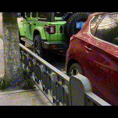

# Number Plate Recognition
## Introduction
This project aims to accurately detect number plates on cars and extract the
number plate from an image/video.

<p align="center">
  
</p>

## Note
Given how domain-specific number plates are for each country/state, number
plate recognition models were trained individually on two countries, Australia
and China. Given the vast amount of training data available online for Chinese
number plates, this model performs much better than the Australian model. Much
more data is required to improve the performance of the Australian model.

## In the Works
- Live recognition on a Raspberry Pi that extracts number plates and sends to
a couchdb database, along with a web interface for checking the logs

## How to Use

#### Clone the Repo and Install Dependencies
```
git clone git@github.com:travisddavies/number_plate_recognition.git

cd number_plate_recognition

pip install -r requirements.txt
```


#### Run the software

For image recognition:

```
python3 image_recognition.py -c <au or ch> -i <input image> -o <saved image>
```

For video Recognition:

```
python3 video_recognition.py -c <au or ch> -i <input video> -o <saved video>
```

Example:
```
python3 video_recognition.py -c ch -i datasets/recognition_datasets/car_videos/IMG_0467.MOV -o result.MOV
```
